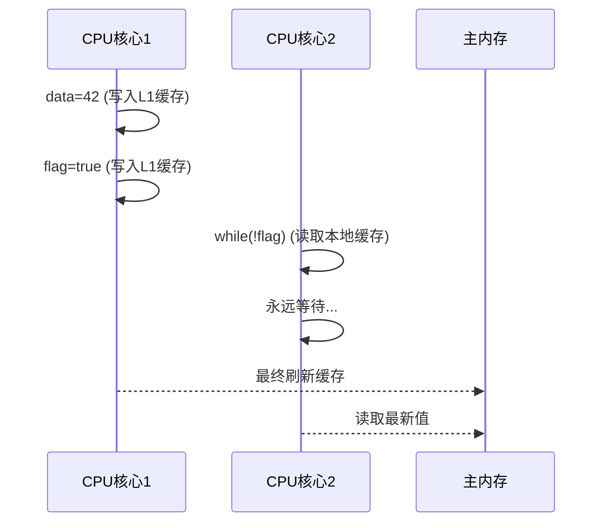
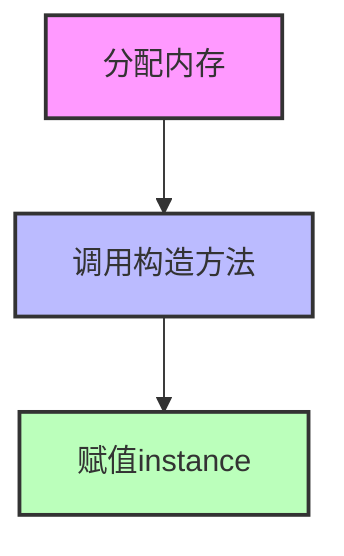

# Java并发编程深度解析：从内存模型到实战优化

## 引言：当多线程遇上现代CPU

在Java世界里，我们常听到"多线程很简单"的说法。但当你真正深入生产环境的高并发系统时，会发现现实远比想象复杂。记得去年我调试一个金融交易系统时，就遇到了一个诡异的问题：两个线程明明都更新了同一个变量，可结果却像薛定谔的猫——有时正确，有时错误。

这背后隐藏的，正是Java内存模型（JMM）与现代CPU架构的深层博弈。今天，让我们揭开这层面纱，从底层原理到实战优化，彻底掌握Java并发编程。

## 1. 内存可见性：不只是volatile那么简单

### 1.1 现实中的缓存一致性问题

现代CPU为了性能，每个核心都有自己的高速缓存。这就导致了一个问题：线程A修改了变量，可能只写入了L1缓存，而线程B读取时，看到的还是自己缓存中的旧值。

```java
// 危险的代码示例
class VisibilityProblem {
    private boolean flag = false;
    private int data = 0;
    
    public void writer() {
        data = 42;
        flag = true; // 可能永远不会被其他线程看到
    }
    
    public void reader() {
        while (!flag) {
            // 忙等待
        }
        System.out.println("data = " + data); // 可能输出0！
    }
}
```

#### mermaid时序图说明



### 1.2 volatile的魔法揭秘

volatile关键字通过内存屏障（Memory Barrier）确保可见性。但它不是银弹——它不能保证复合操作的原子性。

```java
// 错误的用法
public class Counter {
    private volatile int count = 0;
    
    public void increment() {
        count++; // 实际包含三个步骤：读、改、写
    }
}
```

正确的做法是使用`AtomicInteger`：

```java
public class SafeCounter {
    private AtomicInteger count = new AtomicInteger(0);
    
    public void increment() {
        count.incrementAndGet(); // 原子操作
    }
}
```

## 2. 指令重排序：编译器的"优化"陷阱

### 2.1 双重检查锁的前世今生

经典的单例模式中，我们常用双重检查锁：

```java
public class Singleton {
    private static volatile Singleton instance;
    
    private Singleton() {}
    
    public static Singleton getInstance() {
        if (instance == null) {
            synchronized (Singleton.class) {
                if (instance == null) {
                    instance = new Singleton();
                }
            }
        }
        return instance;
    }
}
```

为什么需要volatile？因为`new Singleton()`实际上包含三个步骤：
1. 分配内存空间
2. 调用构造函数初始化对象
3. 将instance指向分配的内存地址

没有volatile时，步骤2和3可能被重排序，导致其他线程拿到未完全初始化的对象。

#### mermaid流程图说明



## 3. CAS与AQS：并发框架的基石

### 3.1 Compare-And-Swap原理解析

CAS是大多数无锁数据结构的基础，它包含三个操作数：
- 内存位置（V）
- 旧的预期值（A）
- 新值（B）

只有当V的值等于A时，才会将V的值更新为B。

```java
// AtomicInteger的部分实现
public final int incrementAndGet() {
    for (;;) {
        int current = get();
        int next = current + 1;
        if (compareAndSet(current, next))
            return next;
    }
}
```

### 3.2 AbstractQueuedSynchronizer探秘

AQS是ReentrantLock、Semaphore等同步器的核心。它维护了一个FIFO等待队列和一个状态变量。

```java
// ReentrantLock的非公平锁实现
final boolean nonfairTryAcquire(int acquires) {
    final Thread current = Thread.currentThread();
    int c = getState();
    if (c == 0) {
        if (compareAndSetState(0, acquires)) {
            setExclusiveOwnerThread(current);
            return true;
        }
    }
    else if (current == getExclusiveOwnerThread()) {
        // 可重入逻辑
        int nextc = c + acquires;
        if (nextc < 0) // overflow
            throw new Error("Maximum lock count exceeded");
        setState(nextc);
        return true;
    }
    return false;
}
```

## 4. 线程池：不只是Executors那么简单

### 4.1 生产环境的线程池配置

不要使用`Executors.newFixedThreadPool()`，它使用无界队列，可能导致OOM。

```java
// 推荐的线程池创建方式
ThreadPoolExecutor executor = new ThreadPoolExecutor(
    10,                                    // 核心线程数
    20,                                    // 最大线程数
    60L,                                   // 空闲线程存活时间
    TimeUnit.SECONDS,
    new LinkedBlockingQueue<>(1000),     // 有界队列
    new ThreadFactoryBuilder().setNameFormat("worker-%d").build(),
    new ThreadPoolExecutor.CallerRunsPolicy() // 饱和策略
);
```

### 4.2 线程池监控

```java
// 监控线程池状态
ScheduledExecutorService monitor = Executors.newSingleThreadScheduledExecutor();
monitor.scheduleAtFixedRate(() -> {
    log.info("Pool Stats - \
" +
            "Active: " + executor.getActiveCount() + "\n" +
            "Queue: " + executor.getQueue().size() + "\n" +
            "Completed: " + executor.getCompletedTaskCount());
}, 0, 10, TimeUnit.SECONDS);
```

## 5. 实战建议：避免常见的并发陷阱

### 5.1 死锁预防

破坏死锁的四个必要条件之一：
- 互斥条件
- 占有并等待
- 不可抢占
- 循环等待

```java
// 按固定顺序获取锁
private final Object lock1 = new Object();
private final Object lock2 = new Object();

public void method1() {
    synchronized (lock1) {
        synchronized (lock2) {
            // do something
        }
    }
}

public void method2() {
    synchronized (lock1) { // 注意：同样先获取lock1
        synchronized (lock2) {
            // do something
        }
    }
}
```

### 5.2 ThreadLocal内存泄漏

```java
// 正确的ThreadLocal使用
private static final ThreadLocal<SimpleDateFormat> formatter = 
    ThreadLocal.withInitial(() -> new SimpleDateFormat("yyyy-MM-dd"));

// 使用后务必清理
try {
    String dateStr = formatter.get().format(new Date());
} finally {
    formatter.remove(); // 防止内存泄漏
}
```

## 结语：并发编程的哲学

掌握Java并发编程，不仅仅是记住几个API和关键字。它要求我们理解计算机体系结构、操作系统原理和编程语言设计的深层交互。正如Doug Lea所说："编写正确的并发程序是一项艺术，而不是简单的技术应用。"

在实际开发中，我的建议是：
1. 优先使用成熟的并发工具类（ConcurrentHashMap、BlockingQueue等）
2. 复杂逻辑先用synchronized，再考虑性能优化
3. 充分测试，特别是压力测试和长时间运行测试
4. 善用监控工具，及时发现潜在问题

记住，最好的并发代码，是那些别人能轻松理解和维护的代码。毕竟，在这个世界上，最复杂的系统永远是人与人之间的协作。

---
*如需更多并发编程实战案例或JVM调优技巧，欢迎留言交流。*