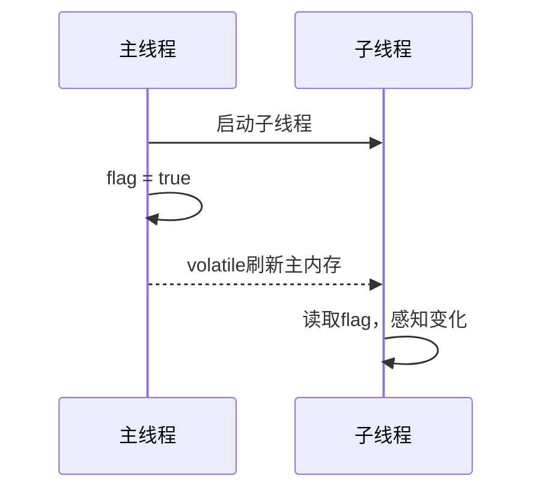
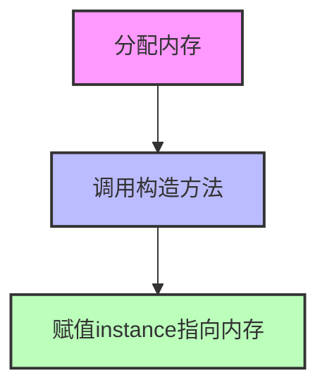

# 深入理解Java volatile：可见性与有序性的底层原理与实战

## 引言

在Java并发编程中，volatile关键字是轻量级同步的重要工具。它常被用于状态标志、单例模式等场景，但很多开发者对其底层原理、适用边界和易错点理解不深。本文将聚焦于volatile的可见性与有序性，结合代码示例和mermaid图，深入剖析其工作机制和最佳实践。

## 1. volatile的可见性

### 1.1 问题引入

```java
class VisibilityDemo {
    static boolean flag = false;
    public static void main(String[] args) {
        new Thread(() -> {
            while (!flag) {}
            System.out.println("flag changed!");
        }).start();
        try { Thread.sleep(100); } catch (InterruptedException e) {}
        flag = true;
    }
}
```

上例中，主线程将flag设为true，但子线程可能永远无法感知变化。原因在于flag未用volatile修饰，导致线程间不可见。

### 1.2 volatile保证可见性

```java
class VisibilityDemo {
    static volatile boolean flag = false;
    // ...existing code...
}
```

加上volatile后，flag的变化会立即对其他线程可见。

#### mermaid时序图说明



## 2. volatile的有序性（禁止指令重排序）

### 2.1 问题引入：双重检查锁单例

```java
class Singleton {
    private static volatile Singleton instance;
    private Singleton() {}
    public static Singleton getInstance() {
        if (instance == null) {
            synchronized (Singleton.class) {
                if (instance == null) {
                    instance = new Singleton();
                }
            }
        }
        return instance;
    }
}
```

如果不加volatile，instance = new Singleton() 可能会被重排序为：
1. 分配内存
2. 赋值instance指向内存
3. 调用构造方法

这样其他线程可能拿到未初始化的对象。volatile禁止了这种重排序。

#### mermaid流程图说明



## 3. volatile的局限与误区

- 不能保证复合操作的原子性，如i++
- 不能替代锁
- 仅适用于状态标志、单例等简单同步场景

## 4. 实战建议

- 用volatile修饰状态标志、单例实例
- 对复合操作用synchronized或原子类
- 理解volatile的可见性和有序性边界

## 5. 结语

volatile是并发编程的利器，但只有理解其底层原理和边界，才能用得安全高效。建议多用代码和图示验证自己的理解。

---
*如需更多并发底层案例或JMM深度剖析，欢迎留言交流。*
