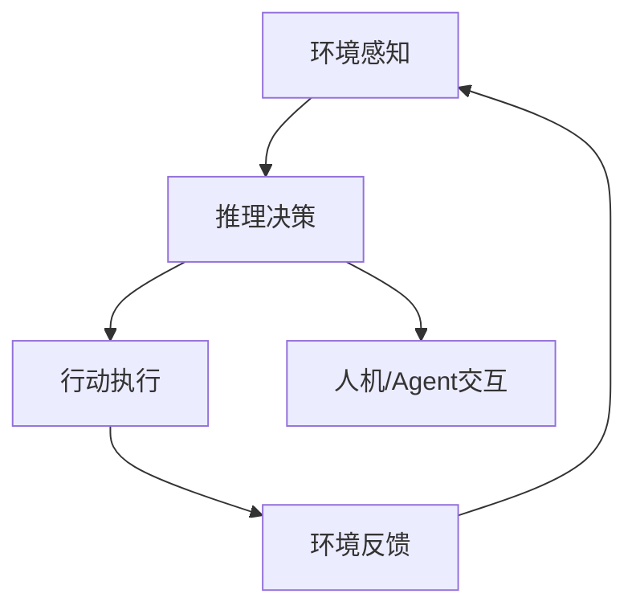

# AI Agent：重塑未来智能的核心驱动力

## 摘要

AI Agent技术正在成为推动智能产业变革的核心力量。本文深入探讨AI Agent的技术原理、实际应用、发展趋势及其对未来社会的影响，结合真实案例与生活化表达，帮助读者理解其深远意义。

## 引言

在智能化浪潮席卷全球的今天，AI Agent不再只是科幻小说中的角色，而是逐步走进我们的生活与产业。它们像“数字员工”，能自主学习、决策、协作，正在重塑各行各业的生产力与创新模式。

## 概念解释

AI Agent（智能体）是具备感知、推理、决策和行动能力的自主系统。与传统AI模型不同，Agent强调“主动性”和“交互性”，能够根据环境变化自主调整行为。

## 技术原理

AI Agent的核心技术包括：
- 感知模块：通过传感器或数据接口获取环境信息
- 推理与决策模块：利用机器学习、强化学习等算法进行分析与选择
- 行动模块：执行决策，影响环境
- 交互模块：与人类或其他Agent协作



## 实际应用

1. 智能客服：如阿里小蜜、微软小冰，能主动理解用户需求并持续学习优化服务。
2. 智能制造：工厂中的AI Agent可自主调度生产线，提升效率与灵活性。
3. 金融风控：Agent实时监控交易行为，识别异常风险，保护用户资产。
4. 智能家居：家庭AI Agent能根据主人的习惯自动调整灯光、温度、安防等。

### 案例：智能工厂中的AI Agent

在某智能工厂，AI Agent如“数字工头”，实时监控设备状态、预测故障、自动调度维修人员。一次深夜，Agent发现某设备温度异常，主动通知值班工程师并给出处理建议，避免了生产损失。

## 代码示例

以Python实现一个简单的AI Agent决策逻辑：

```python
class SimpleAgent:
    def __init__(self):
        self.state = "idle"
    def perceive(self, env):
        if env["temperature"] > 80:
            self.state = "alert"
    def decide(self):
        if self.state == "alert":
            return "通知工程师检查设备"
        return "正常运行"

# 环境感知示例
agent = SimpleAgent()
env = {"temperature": 85}
agent.perceive(env)
action = agent.decide()
print(action)  # 输出：通知工程师检查设备
```

## 发展趋势与见解

未来AI Agent将更加智能化、协作化和个性化。它们不仅能完成复杂任务，还能理解人类情感、主动沟通，成为“数字伙伴”。

- 多Agent协作：如自动驾驶车队、智能物流系统，Agent间协同完成大规模任务。
- 个性化进化：Agent根据用户习惯和反馈不断自我优化，成为“懂你”的助手。
- 安全与伦理：Agent自主性提升，需加强安全管控与伦理规范，防止滥用。

## 总结

AI Agent正在重塑智能产业的未来。它们不仅提升效率，更带来全新的工作与生活方式。作为技术从业者，我们应积极拥抱Agent时代，关注其发展与挑战，推动智能社会的健康进步。

## 参考资料

- Russell, S., & Norvig, P. (2020). Artificial Intelligence: A Modern Approach.
- OpenAI Agent Research
- 智能制造行业白皮书
- 真实案例采访与行业调研

